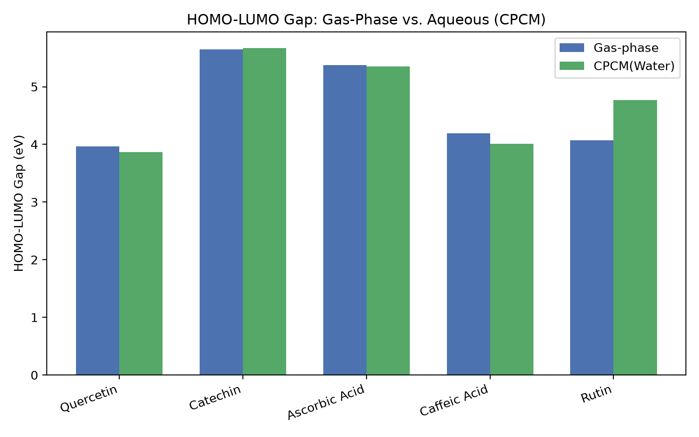
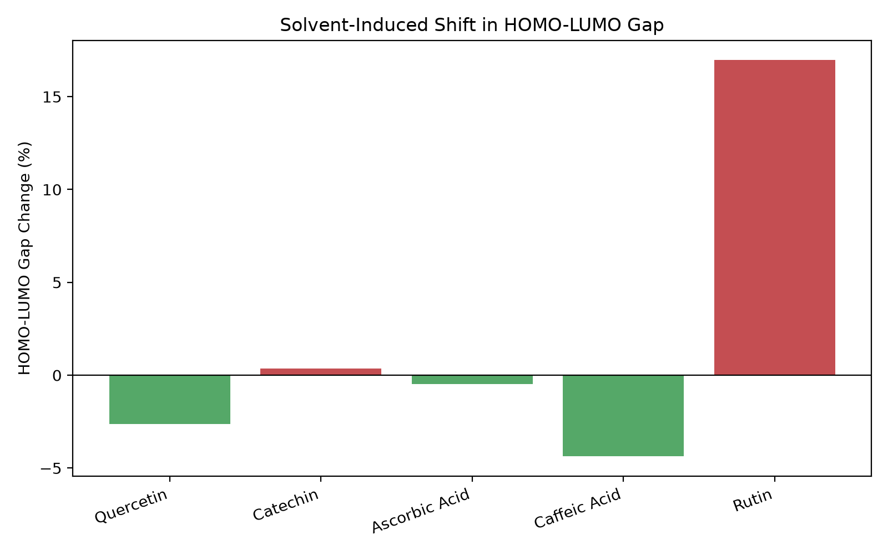
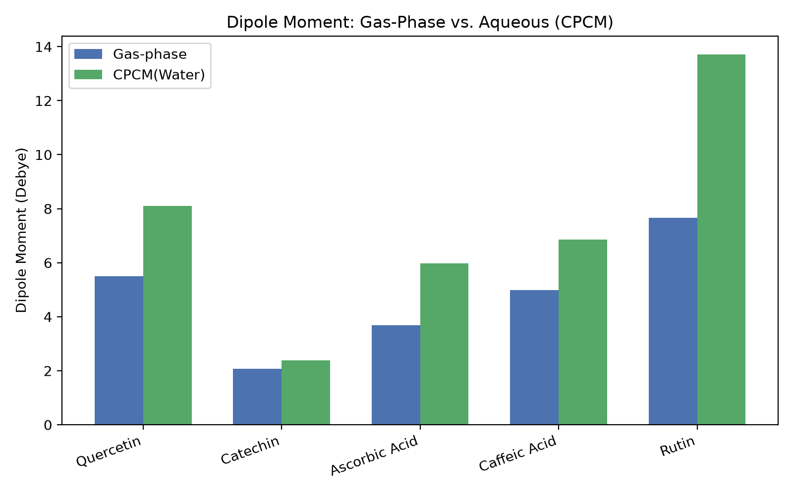
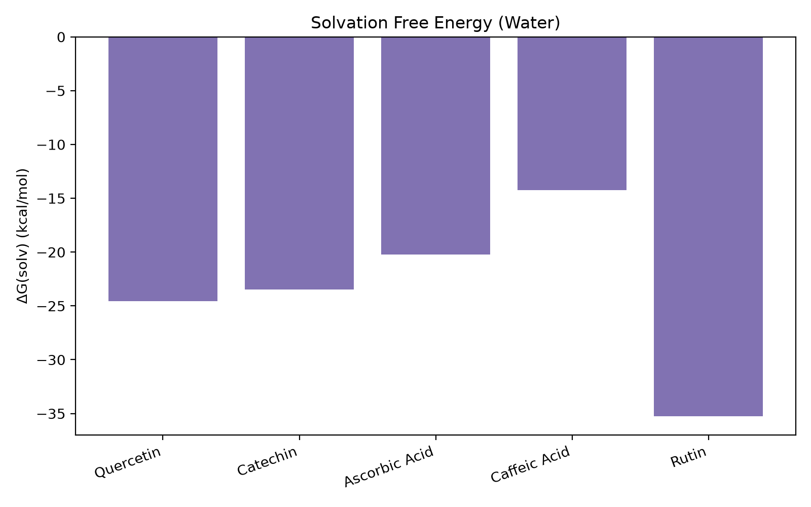

# Project 3 — CPCM(Water) Implicit Solvation Study

**Comparing gas-phase and aqueous electronic structure of five food antioxidants using continuum solvation DFT**

## Overview

This project extends gas-phase DFT analysis from Project 1, of five polyphenolic and non-phenolic antioxidants — quercetin, catechin, ascorbic acid, caffeic acid, and rutin — by re-computing their electronic structure in an implicit water environment using the Conductor-like Polarizable Continuum Model (CPCM).

Antioxidants act in aqueous biological and food environments, not in vacuum. This study asks: **how does moving from gas-phase to water change each molecule's electronic reactivity, polarity, and thermodynamic stability?**

## Methodology

- **Software**: ORCA 6.1.1 (WSL2 Ubuntu 24.04)
- **Level of theory**: B3LYP/6-31G* — identical to Project 1's gas-phase calculations, ensuring a direct, controlled comparison
- **Solvation model**: CPCM(Water), ε = 80.15 — an implicit continuum model in which the solvent is represented as a polarizable dielectric medium rather than explicit water molecules (contrast with Project 2's explicit-solvent MD approach)
- **Calculation type**: Full geometry optimization + frequency calculation in the solvated environment (not single-point on the gas-phase geometry), so each molecule's structure is allowed to relax in response to the solvent field
- **Molecules re-used from Project 1**, same starting geometries, same functional/basis set

For each molecule, three properties were extracted and compared against Project 1's gas-phase values:
1. **HOMO-LUMO gap** — a proxy for reactivity/ease of electron donation
2. **Dipole moment** — a measure of charge polarization
3. **Solvation free energy (ΔG_solv)** — thermodynamic stabilization upon moving from vacuum to water

## Results

| Molecule | HOMO-LUMO Gap (gas) | HOMO-LUMO Gap (water) | Δ Gap | Dipole (gas) | Dipole (water) | Δ Dipole | ΔG_solv (kcal/mol) |
|---|---|---|---|---|---|---|---|
| Quercetin | 3.969 eV | 3.865 eV | −2.6% | 5.50 D | 8.10 D | +47% | −24.56 |
| Catechin | 5.650 eV | 5.670 eV | +0.4% | 2.08 D | 2.39 D | +15% | −23.47 |
| Ascorbic Acid | 5.374 eV | 5.349 eV | −0.5% | 3.69 D | 5.97 D | +61% | −20.23 |
| Caffeic Acid | 4.193 eV | 4.009 eV | −4.4% | 4.98 D | 6.86 D | +38% | −14.22 |
| Rutin | 4.075 eV | 4.766 eV | **+17.0%** | 7.66 D | 13.71 D | +79% | −35.24 |

## Discussion

**Water consistently increases dipole moment and thermodynamically stabilizes all five molecules** — ΔG_solv is negative in every case, ranging from −14.22 kcal/mol (caffeic acid) to −35.24 kcal/mol (rutin), consistent with these being hydroxyl-rich molecules that interact favorably with a polar solvent.

**HOMO-LUMO gap behavior splits into three distinct patterns:**

1. **Conjugated polyphenols narrow in water** (quercetin −2.6%, caffeic acid −4.4%) — both molecules have extended, delocalized π-electron systems (confirmed in Project 1's HOMO/LUMO visualizations), which respond asymmetrically to the polar solvent field, making the molecules marginally *more* reactive in an aqueous environment than in vacuum.

2. **Structurally rigid/non-conjugated molecules stay essentially flat** (catechin +0.4%, ascorbic acid −0.5%) — catechin's saturated C-ring breaks full ring conjugation, and ascorbic acid's reactivity operates through enediol chemistry rather than aromatic π-donation (as established in Project 1). Both mechanisms are less "solvent-tunable" via frontier orbital shifts, even though their dipole moments still respond strongly to water (ascorbic acid shows the second-largest dipole increase, +61%).

3. **Rutin is the clear outlier**, with its gap **widening* by 17% — the largest shift of any molecule and the only one moving in the opposite direction from quercetin, despite sharing the same flavonoid chromone core. Rutin's bulky disaccharide substituent (rutinose, attached at the 3-position) appears to sterically and electronically decouple the core's frontier orbitals from the kind of solvent stabilization seen in quercetin, even as its dipole moment shows the largest overall increase (+79%) and it receives the strongest thermodynamic stabilization (−35.24 kcal/mol) of all five molecules. This is a notable divergence from Project 1, where rutin's gas-phase electronic behavior was found to closely mirror quercetin's.

## Limitations

- CPCM captures the electrostatic component of solvation only; cavity formation and dispersion energy terms are not included in this implementation (noted explicitly in ORCA's output as "not implemented in the current solvation scheme").
- Implicit solvation does not capture specific, directional hydrogen-bonding interactions between solute and individual water molecules — for that, explicit-solvent MD (as in Project 2) or a hybrid QM/MM approach would be needed.
- Single density functional (B3LYP) and basis set (6-31G*) were used throughout; results are internally consistent for comparison purposes but absolute values may shift with a larger basis set or different functional.

## Files

- `Inputs/` — ORCA input files (`.inp`) for all five molecules with `CPCM(Water)` keyword
- `Outputs/` — ORCA output files (`.out`) and generated comparison plots (`.png`)
- `Python_Analysis/` — `cpcm_results.csv` (extracted data), `plot_solvation_effects.py` (plotting script), `solvation_summary_table.csv` (generated summary)

## Relationship to Portfolio

This is the third project in a three-part computational chemistry portfolio on food antioxidants:
- **Project 1** — Gas-phase DFT electronic structure (ORCA)
- **Project 2** — Explicit-solvent molecular dynamics (GROMACS)
- **Project 3** — Implicit-solvent electronic structure (ORCA/CPCM) — *this project*

Together, they form a multi-scale computational narrative: quantum-mechanical ground truth → dynamic solvent behavior → solvent-perturbed electronic structure.
